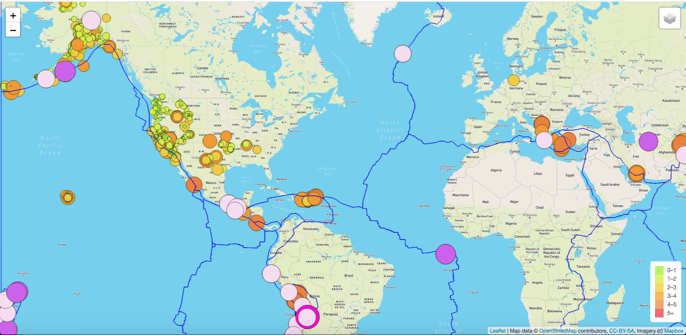
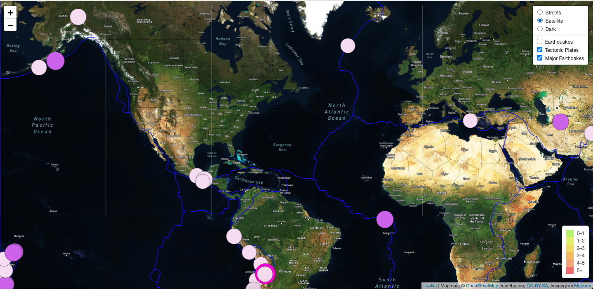
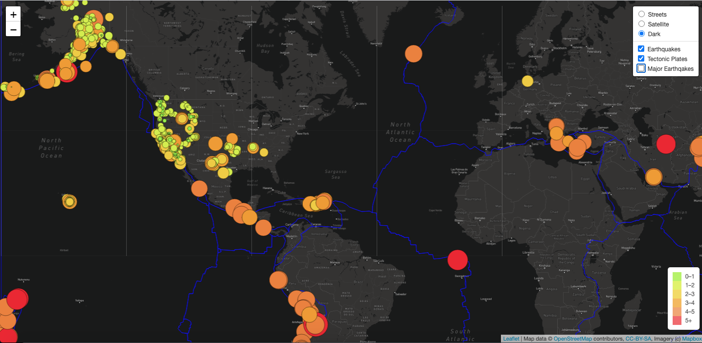

# Mapping_Earthquakes
Module 13 Bootcamp

# Purpose
The purpose of this project is to visually show the differences between the magnitudes of earthquakes all over the world for the last seven days.

Technologies
- JavaScript 
- D3.js library
- Leaflet library 
- Mapbox API (GeoJSON)

Information pages

Information was taken from these pages:

- https://earthquake.usgs.gov/ 
- https://github.com/fraxen/tectonicplates/blob/master/GeoJSON/PB2002_plates.json 

# Results
Interactive map with current information

- Map street view

- Map satelite view

- Map dark view

